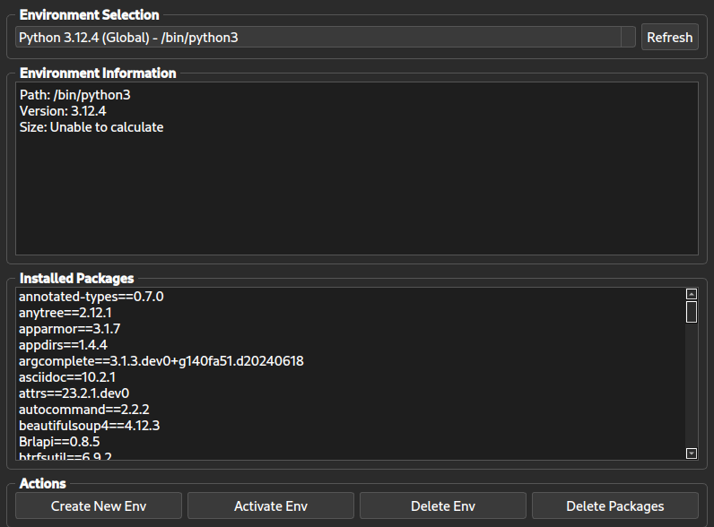

# Python Virtual Environment Manager GUI

This application provides a graphical user interface for managing Python virtual environments. It allows users to create, delete, and manage Python environments and their packages.

## Screenshot



## Features

- List all available Python environments (global, pyenv, and virtual environments)
- Display detailed information about each environment
- Create new virtual environments with specific Python versions
- Delete existing environments
- View and manage packages within each environment
- Modern, dark-themed user interface

## Prerequisites

- Python 3.6 or higher
- PyQt6
- pyenv (for creating environments with specific Python versions)

## Installation

1. Clone this repository:
   ```
   git clone https://github.com/realcgslav/python-venv-manager-gui.git
   cd python-venv-manager-gui
   ```

2. Create a virtual environment and activate it:
   ```
   python -m venv venv
   source venv/bin/activate  # On Windows, use `venv\Scripts\activate`
   ```

3. Install the required packages:
   ```
   pip install PyQt6
   ```

4. Ensure pyenv is installed on your system. If not, follow the [pyenv installation guide](https://github.com/pyenv/pyenv#installation).

## Usage

To run the application, execute the following command from the project directory:

```
python main.py
```

The GUI will open, allowing you to:

- Select and view information about different Python environments
- Create new virtual environments
- Delete existing environments
- View and manage packages within each environment

## Contributing

Contributions are welcome! Please feel free to submit a Pull Request.

## License

This project is licensed under the MIT License - see the [LICENSE](https://opensource.org/license/mit) file for details.